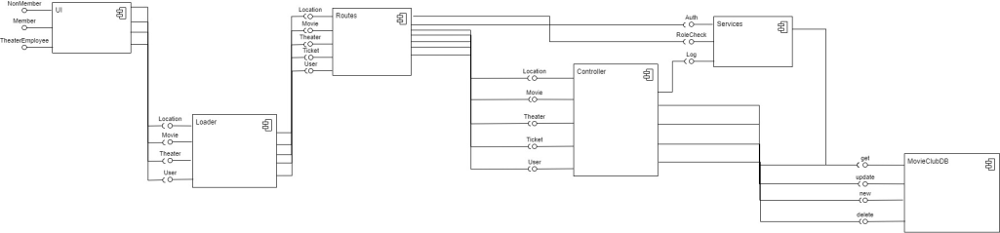
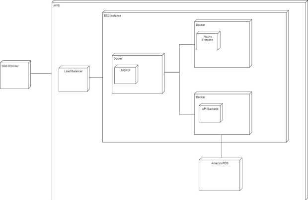

# Tech Stack 

Frontend: Angular

Backend: ExpressJS

Deployment: Nginx, Docker, AWS loadbalancer ,Auto Scaling Group, EC2

# How to run the Web App

1. `cd ui-components`

2. `npm install`

3. `npm run start`

# How to run service

1. `cd services/movies`

2. `npm install`

3. `npm run dev`

# How to run web app and services with docker

1. Install docker locally

2. Run command `docker-compose up -d`

# System Architecture

# Component Diagram

# Deployment Diagram

